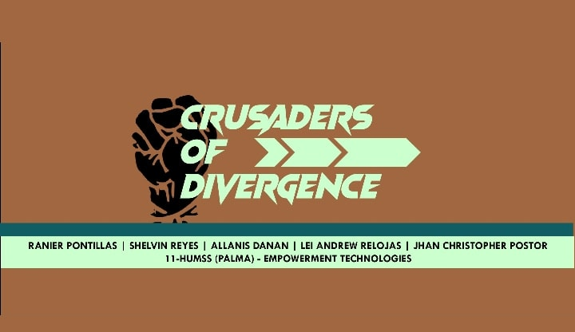
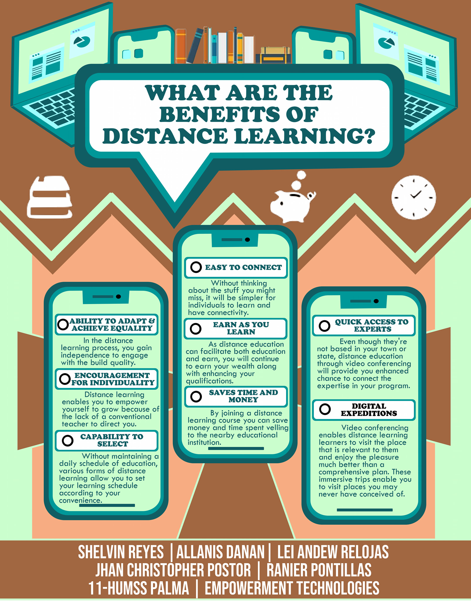

<h1 align="center">
	 
</h1>

# WHAT ARE THE BENEFITS OF DISTANCE LEARNING
Magistrates, ladies and gentlemen, and youths of all ages. We knew that we are all settling in a decent life before this pandemic crushed the sleeping royalty in our places. This pandemic has certainly transformed us in various manners. 
  
## But, is it the world changing us or it is we changing the world?

Today, allow us, **Crusaders**, to introduce to you the different benefits of distance learning. Not only for the students but also to the different educational institutes. Let's begin with the following points:

<h1 align="center">
	 
</h1>

### ABILITY TO ADAPT AND ACHIEVE EQUALITY
In the distance learning process, you gain independence to engage with the build quality. Rather than sticking with a set timetable, you should arrange your cognitive development according to your convenience.

### ENCOURAGEMENT FOR INDIVIDUALITY
Distance learning enables you to empower yourself to grow because of the lack of a conventional teacher to direct you.

### CAPABILITY TO SELECT
Without maintaining a daily schedule of education, various forms of distance learning allow you to set your learning schedule according to your convenience.

### EASY TO CONNECT
Without thinking about the stuff you might miss, it will be simpler for individuals to learn and have connectivity. Particularly for those who struggle to work in a noisy environment, it can be very beneficial.

### EARN AS YOU LEARN
As distance education can facilitate both education and earn, you will continue to earn your wealth along with enhancing your qualifications.

### SAVES TIME AND MONEY
By joining a distance learning course you can save money and time spent velling to the nearby educational institution. Distance learning allows you to access your learning center online without any additional cost.

### QUICK ACCESS TO EXPERTS
Even though they're not based in your town or state, distance education through video conferencing will provide you enhanced chance to connect the expertise in your program. They can instantly get acquainted with you and express their perspectives and skills with you from every area of the globe.

### DIGITAL EXPEDITIONS
Video conferencing enables distance learning learners to visit the place that is relevant to them and enjoy the pleasure much better than a comprehensive plan. These immersive trips enable you to visit places you may never have conceived of.

We hope that you learned something valuable today as we share significant insights and thoughts about this topic. We are all hoping to see every one of you looking at the brighter side of life instead of being stuck in the darkness. Turn your fear into a new step of growth and development. Thank you!

#### CRUSADERS OF DIVERGENCE (11-HUMSS PALMA)
  * Lei Andrew Relojas
  * Allanis Danan
  * Shelvin Reyes
  * Ranier Pontillas
  * Jhan Christopher Postor
